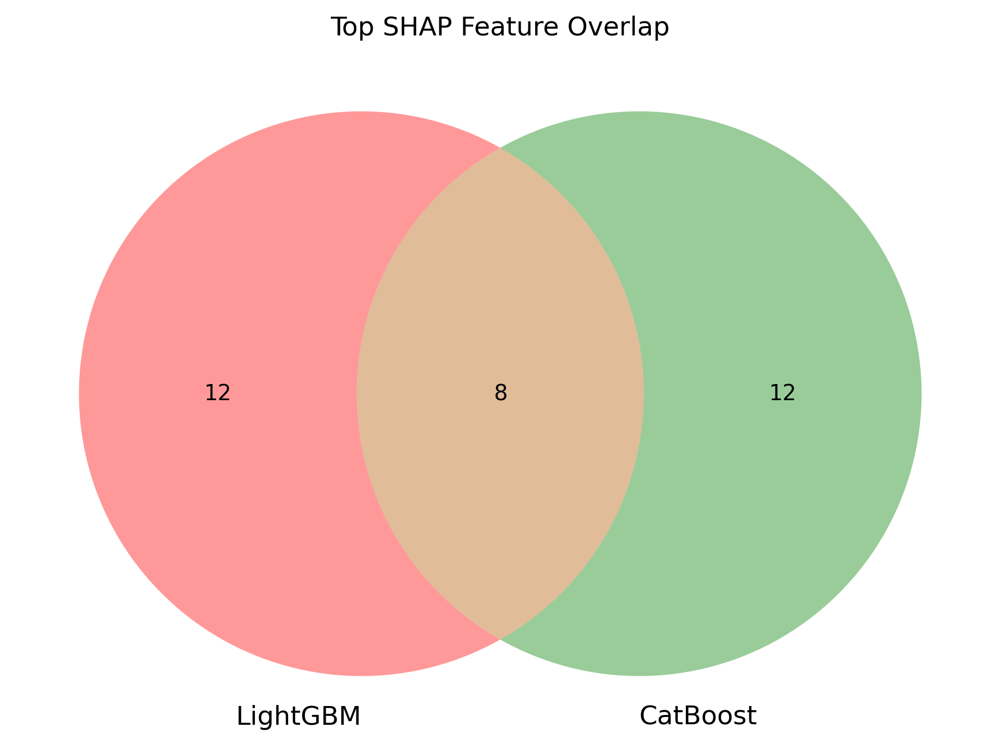

# Credit Risk Prediction with LightGBM, CatBoost & SHAP

This project predicts loan default risk using optimized feature engineering and interpretable ML models. It compares LightGBM and CatBoost using SHAP to visualize and explain feature influence. Built using the Kaggle Home Credit dataset.

---

## Highlights

- Efficient feature engineering using Polars
- Dual-model training with LightGBM & CatBoost
- SHAP summary plots and model explainability
- Venn diagram comparison of top features
- Interpretable ML for credit scoring decisions

---

## SHAP Explainability

---

SHAP (SHapley Additive exPlanations) is a model-agnostic explainability technique that helps interpret how each feature contributes to a model’s prediction.

In this project:
- SHAP is used to analyze feature importance in both LightGBM and CatBoost models
- It provides consistent global and local interpretability
- Helps uncover which features push the prediction toward default or non-default
- Enhances transparency in credit risk modeling

---

### Top Feature Overlap (Venn Diagram)

<p align="center">
  
</p>

Of the top 20 SHAP-ranked features:
- 8 are shared across both models
- 12 are unique to LightGBM
- 12 are unique to CatBoost  

This highlights the value of model diversity and complementary learning.

## Folder Structure

---

creditcard_risk_prediction/ │ ├── README.md # Project overview and SHAP results ├── requirements.txt # Dependency list ├── notebooks/ │ └── credit_risk_prediction_with_shap.ipynb # Model training and SHAP ├── shap_outputs/ │ ├── shap_lgb_summary.png # LightGBM SHAP summary plot │ ├── shap_catboost_summary.png # CatBoost SHAP summary plot │ └── shap_feature_overlap_venn.png # Venn diagram of top features
---

## Results (CV AUC)

| Model     | AUC Score     |
|-----------|---------------|
| LightGBM  | ~0.81–0.85    |
| CatBoost  | ~0.81–0.82    |

---

## Setup

Install dependencies:

```bash
pip install -r requirements.txt
